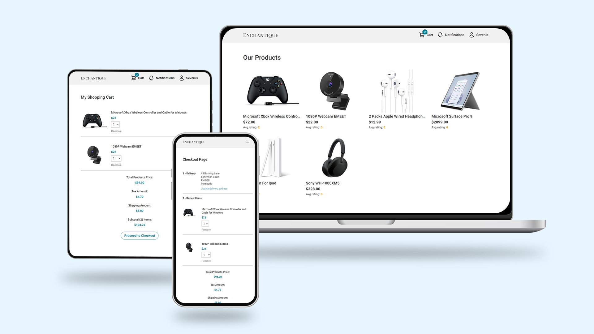

# Enchantique (E-Commerce)



Watch demo [here](https://youtu.be/TvJKEqa8iVw).

## About

An e-commerce web application designed to provide seamless navigation and a smooth checkout experience, ensuring that users can easily browse, select, and purchase products with minimal effort. The platform emphasizes high usability, featuring a clean and intuitive interface where all essential functions work flawlessly. Secure login and registration systems protect user data, while the add-to-cart feature allows for effortless product selection and quantity adjustments. The streamlined checkout process, coupled with a reliable payment gateway, ensures quick and secure transactions. Additionally, real-time order tracking with automated notifications keeps users informed about their purchase status, offering a comprehensive and hassle-free shopping experience.

## Table of Contents

-  [Features](#features)
-  [Usage](#usage)
-  [Project Structure](#project-structure)
-  [Acknowledgements](#contributing)

Got it! Here's the feature section using the markdown syntax:

## Features

-  **User Registration**: Implemented a secure and intuitive registration system, enabling new users to create accounts and access the platform’s features.

-  **Secure Login**: Integrated robust authentication using JWT to ensure secure login and session management, protecting user data and maintaining session integrity.

-  **User Profile Update**: Enabled users to securely update their profile information, allowing them to manage their personal details and preferences with ease.

-  **Admin Functionality**: Developed comprehensive admin features for managing products, orders, and users, allowing administrators to add, update, and remove products, monitor orders, and oversee user accounts.

-  **Real-Time Order Tracking**: Integrated Socket.IO for real-time order tracking, allowing users to monitor their purchases as they progress through the delivery process.

-  **Dynamic Add-to-Cart Functionality**: Created a dynamic add-to-cart feature, enabling users to easily select and modify product quantities for a seamless shopping experience.

-  **Payment System**: Integrated a secure payment system using Stripe.js, ensuring smooth and reliable transactions during checkout.

## Usage

### 1. Clone the Repository

Clone the repository using the following command:

```bash
git clone [repository_url]
```

### 2. Add Environment Variables

Refer to the `template.env` file provided in the repository. Add your own environment variables based on the template. These variables should include credentials for MongoDB, Stripe.js and JWT.

### 3. Install Dependencies

First, navigate to the root directory of the project and run:

```bash
npm install
```

Next, change directory to the `frontend` folder:

```bash
cd frontend
npm install
```

Then, change directory to the `backend` folder:

```bash
cd ../backend
npm install
```

### 4. Run the Application

After installing all dependencies, you can start the application by running:

```bash
npm run dev
```

This will start the application in your default web browser.

## Project Structure

### ./backend

```plaintext
├── /config/                  # JavaScript file for database connection
├── /controllers/             # JavaScript files for controllers
├── /data/                    # JavaScript files to store dummy data for testing
├── /helpers/                 # JavaScript files for helper functions
├── /middleware/              # JavaScript files for middlewares
├── /dataModels/              # JavaScript files for data models for database
├── /routes/                  # JavaScript files for backend endpoints
├── /Dockerfile               # Docker configuration file
├── /seeder.js                # JavaScript file for seeding and remove dummy data for initial application startup
└──  /server.js                # JavaScript file entry point for the backend server
```

### ./frontend

```plaintext
├── /public/                  # Contain image files and main entry point of html file
├── /src/components/          # JSX files for react components
├── /src/screens/             # JSX files for pages
├── /src/slices/              # JavaScript files for Redux slices
├── /src/tests/               # JavaScript files for components testing
├── /src/helpers/             # JavaScript files for helper functions and constant variables
├── /index.js                 # Frontend entry point for the application
├── /store.js                 # JavaScript file for storing and configuring Redux store
├── /Dockerfile               # Docker configuration file
├── /.eslintrc.json           # ESLint configuration file
└── /tailwind.config.js       # JavaScript file for tailwind configuration
```

### ./tests/unit-tests

```plaintext
├── /db-integration-test      # JavaScript files for database integration tests
└── /unit-tests/              # JavaScript files unit testing
```

### ./github/workflows

```plaintext
└── /ci.yml                   # GitHub Workflow configuration file
```

### ./

```plaintext
├── babel.config.js           # Babel configuration file
├── docker-compose.yml        # Docker Compose configuration file
├── template.env              # Template for env variables required to run the application
└── template.env.test         # Template for env variables required to test the application

```

## Acknowledgements

### Backend Dependencies

-  **bcryptjs** (^2.4.3)
-  **cookie-parser** (^1.4.6)
-  **cors** (^2.8.5)
-  **express** (^4.18.2)
-  **jsonwebtoken** (^9.0.2)
-  **mongodb** (^6.3.0)
-  **mongoose** (^8.0.3)
-  **socket.io** (^4.7.3)
-  **stripe** (^14.11.0)

### Development Dependencies

-  **@babel/preset-env** (^7.23.6)
-  **chai** (^5.0.0)
-  **concurrently** (^8.2.2)
-  **cross-env** (^7.0.3)
-  **dotenv** (^16.3.1)
-  **eslint** (^8.56.0)
-  **eslint-plugin-react** (^7.33.2)
-  **eslint-plugin-react-hooks** (^4.6.0)
-  **eslint-plugin-react-refresh** (^0.4.5)
-  **jest** (^29.7.0)
-  **mocha** (^10.2.0)
-  **nodemon** (^3.0.2)
-  **supertest** (^6.3.3)
